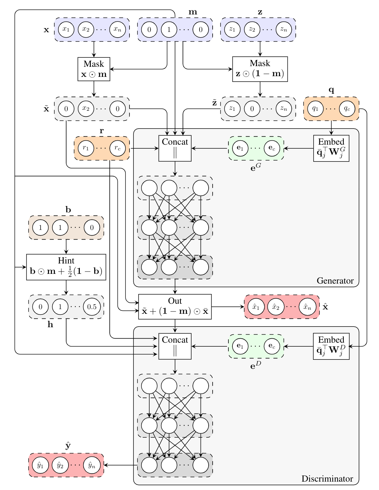
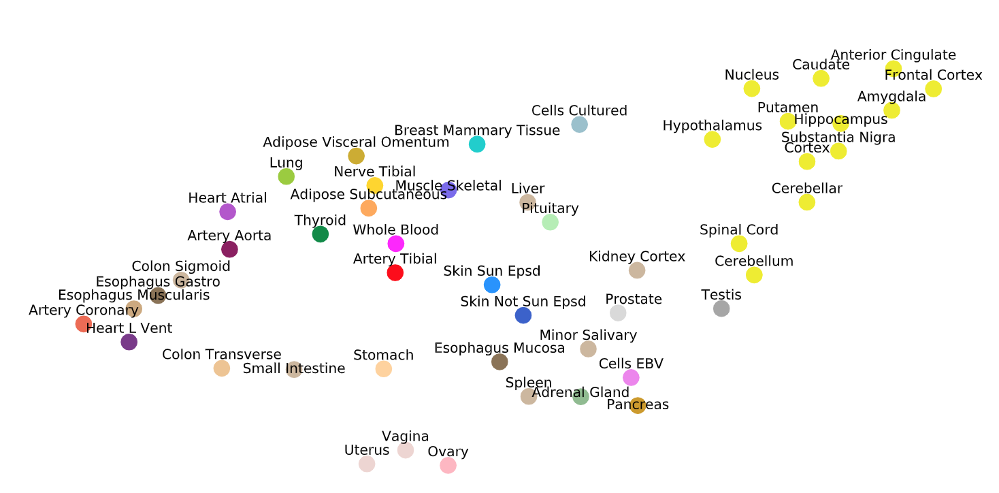
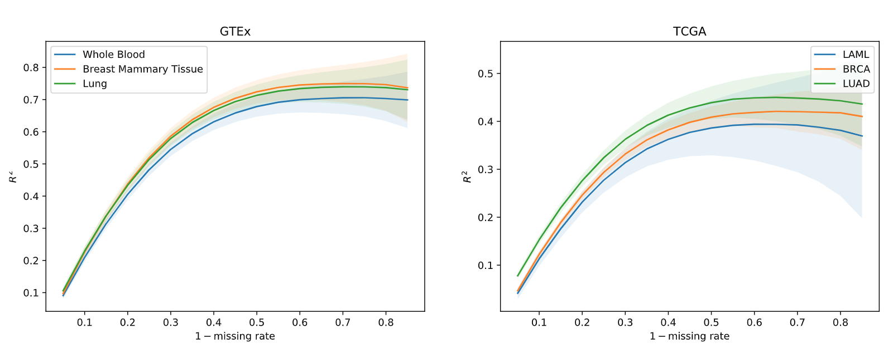

# GAIN-GTEx
Gene Expression Imputation with Generative Adversarial Imputation Nets

<!-- 
Figure 1: Architecture of GAIN-GTEx. -->

## GTEx data
The GTEx gene expression data is available at: https://gtexportal.org/

## Dependencies
```
numpy==1.18.3
tensorflow==2.1.0
tensorflow-probability==0.9.0
scipy==1.4.1
seaborn==0.9.0
pandas==0.24.2
matplotlib==3.0.3
scikit-learn==0.22.1
```

## Training
To train the model with default hyperparameters, run:
```
python gtex_gain.py
```

<!--
## Results

Figure 2: R2 imputation scores per GTEx tissue with a missing rate of 50%. Each box shows the distribution of the per-gene R2 scores in the extended test set (where all the tissues are equally represented). The colour of each box represents the number of training samples of the corresponding tissue.

Figure 3: UMAP visualisation of the tissue embeddings from the generator. Colors are assigned toconform to the GTEx Consortium conventions. Note that the central nervous system, consisting ofthe 13 brain tissues, clusters together on the top right corner.

Figure 4: R2 imputation scores per tissue across missing rate for 3 TCGA cancers and their healthy counterpart in GTEx (test set). The shaded area represents one standard deviation of the per-gene R2 scores in the corresponding tissue. The greater the rate of missingness, the lower the performance.
-->


